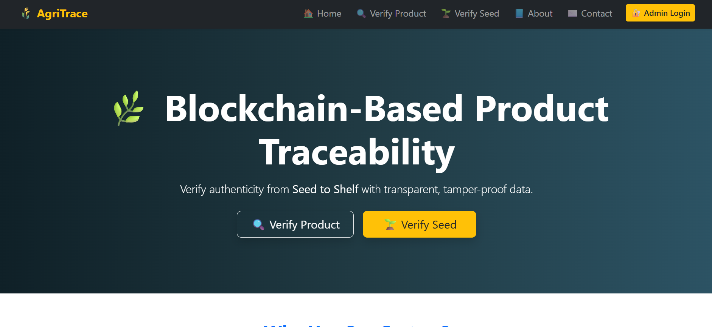
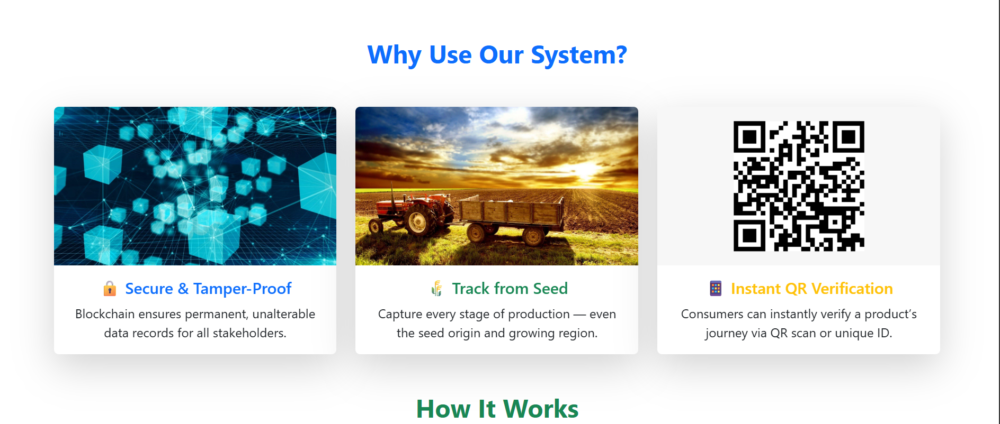
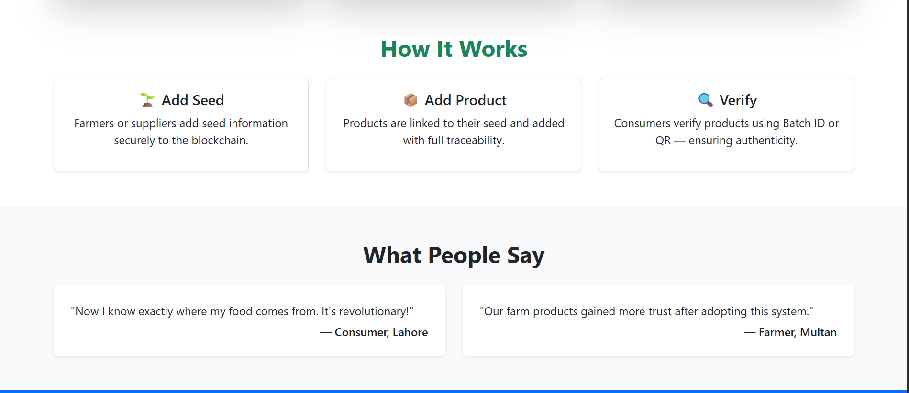
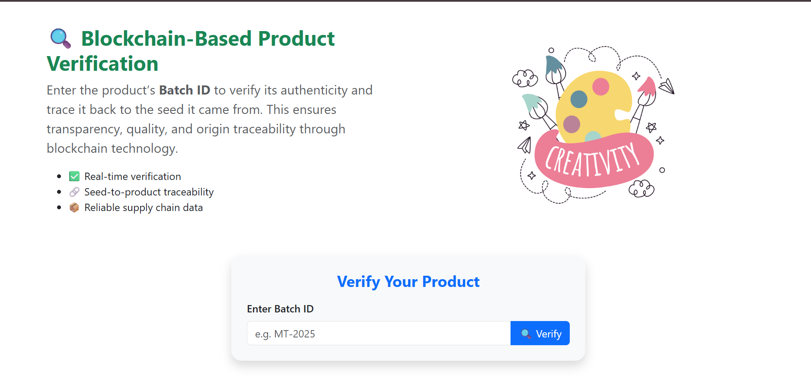
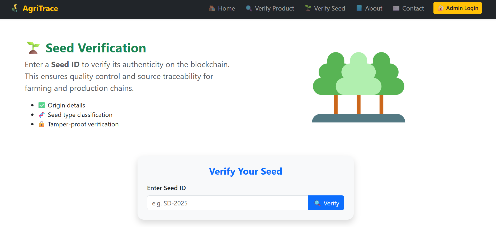
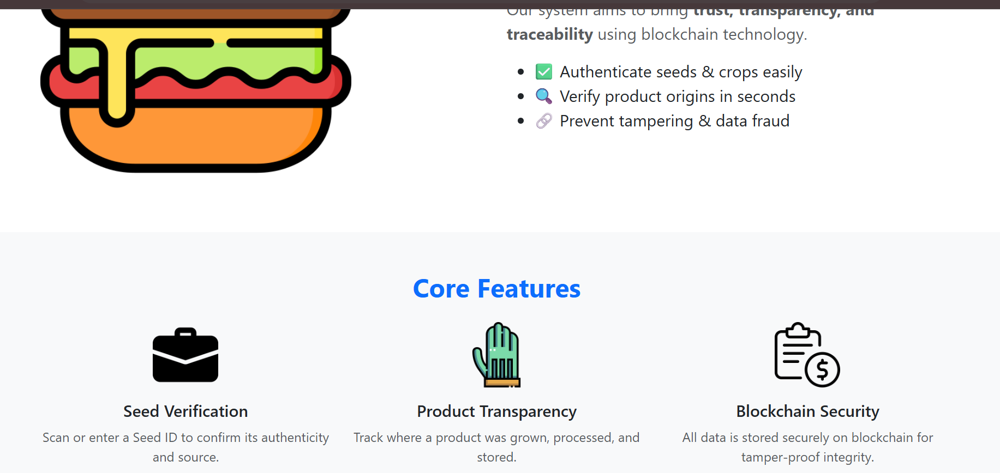
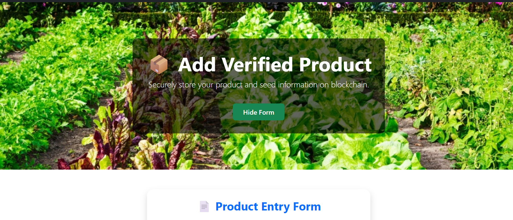

# 🌾 AgroChain

AgroChain is a blockchain-based agricultural product verification system built with **React**, **Web3.js**, and **Firebase**.  
It allows farmers, suppliers, and consumers to verify the authenticity of products by tracking their origin from **seed to sale** using blockchain.

---

## 📸 Screenshots

<p align="center">
  
  
  
  
  
  
  
  
</p>

---

## 🚀 Features
- Add and verify **products** using blockchain.
- Add and verify **seeds** linked to products.
- **Role-based access** (Admin for adding data, Users for verification).
- Real-time updates with **Firebase Firestore**.
- Beautiful and responsive **Bootstrap UI**.
- MetaMask integration for blockchain transactions.

---

## 🛠 Tech Stack
- **Frontend:** React.js, Bootstrap
- **Blockchain:** Solidity, Web3.js, Ethereum
- **Backend:** Firebase Firestore
- **Tools:** MetaMask, GitHub

---

## ⚙️ Installation & Setup
1. Clone this repository:
   ```bash
   git clone https://github.com/chashmanrazzaq/AgroChain.git
